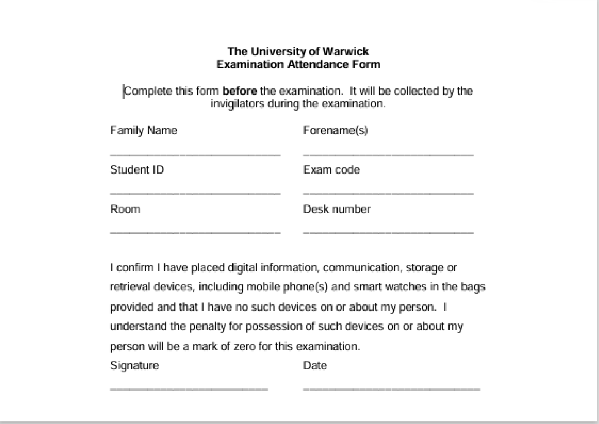

```{r setup, include=FALSE}
knitr::opts_chunk$set(
  echo = TRUE, warning = FALSE, message = FALSE, error = FALSE, collapse = TRUE
)

# Set font size for all code chunks
knitr::knit_hooks$set(size = function(before, options, envir) {
  if (before) {
    if (is.character(options$size)) return(paste0("\\", options$size, "\n"))
    else if (isTRUE(options$size)) return("\\fontsize{8}{8}\\selectfont\n")
  } else {
    return("\\normalsize\n")
  }
})

knitr::opts_chunk$set(size = TRUE)

extrafont::loadfonts(quiet = TRUE)
options("tinytable_theme_placement_latex_float" = "H")
```

\onehalfspacing
\noindent

# Before the Exam

### When will my examinations be taking place?

> For a full list of examination dates and times, please visit the [Examination Dates and Times webpage](https://warwick.ac.uk/services/academicoffice/modules_marks_assessments/students/examination_dates/).


### Where will the exams take place?

> The venue information will be available in your personalised timetable. Please note that all exams will take place on the main campus. A full list of venues used for each exam session can be viewed on the [Campus Maps and Exam Venues webpage](https://warwick.ac.uk/services/academicoffice/modules_marks_assessments/students/on_campus_exams_guidance_students/exam_venues). Remember that large modules may have multiple venues so please ensure you go to the venue indicated on your personalised timetable. Please note, exam venues will only appear on this page once the exam timetable for the relevant exam period has been published.


### How will I know where to sit?

> You can find your seat number in your personalised exam timetable. If you forget your seat number, there will be somebody in the exam hall with a seating plan.


### I want to defer my exams. What should I do?

> Where a student has acute personal circumstances that severely impact on their ability to sit or prepare for a complete examination period and that are evidenced, a deferral of the examination period to the next available opportunity can be requested. Students wishing to defer should speak with the [PAIS Wellbeing and Academic Support Team](mailto:pais.dswb@warwick.ac.uk) about deferral at the first possible opportunity, but no later than five working days before the examination period starts. [Find out more on how to submit a Deferral of an Examinations Period request](https://warwick.ac.uk/services/aro/dar/quality/categories/examinations/marks/examboard/deferral/).

\newpage

### I require reasonable adjustments, whom should I contact to arrange this?

> To be considered for [reasonable adjustments](https://warwick.ac.uk/fac/soc/pais/currentstudents/wellbeing/personalcircumstances/), we encourage you to [meet with a Disability Adviser](https://wellbeing.warwick.ac.uk/). The Disability team’s recommendations are informed by information about your disability, including any relevant, recent medical or other professional evidence. If you do not already have any information or evidence, you can get a medical professional to complete [the medical evidence form](https://warwick.ac.uk/services/wss/students/disability/howwecanhelp/adjustments/university_of_warwick_medical_evidence_form.docx). 

> If you do not have any documentation related to your disability or long-term health condition, we would still encourage you to make an appointment to speak with a Disability Adviser, as there may be other options available to you.

> Please note that reasonable adjustments are anticipatory and need to be made well in advance of the exam period, so please contact the Disability team as early as possible. You can find information about the relevant deadlines [here](https://warwick.ac.uk/services/academicoffice/modules_marks_assessments/students/alternative_examination_arrangements/).

> Once your reasonable adjustments are in place, please contact the [PAIS Wellbeing and Academic Support Team](mailto:pais.dswb@warwick.ac.uk) if you wish to discuss specific arrangements for an exam.


### How do I find out about my reasonable adjustment arrangements for my exam?

> The Course Support Team will email you before your exam takes place. We aim to provide you with details of your arrangements about a week before your exam is due. Please make sure you check your university emails regularly.

### I have adjustments in the exam so I can use ear plugs/anxiety aid/tablets, etc., should I let the invigilator know before the exam takes place?

> On the day of your exam, the invigilator should have a list provided to them about students who have reasonable adjustments and what they are. This information would have been agreed by the Disability team in advance and will be listed on each student’s personal stop-the-clock form which the invigilator will have.


### What happens if an exam starts late?

> While the intention is to start morning exams at 09:30 and afternoon exams at 14:00, things may happen which means the exam will start late. Please wait outside until you are called into the exam room and take your seat quickly, so that the exam can start as soon as possible. If the exam starts late, you will still be given the full time as indicated by your exam paper.

### I can bring a calculator to the exam. How do I know which one I can bring?

> If a calculator is permitted, you should use a battery-operated, non-programmable pocket calculator, a 'scientific' type which has logarithms (both common and natural), square root, etc. 

> Programmable calculators are not permitted.

\newpage

### Do I need to bring my Student ID card?

> Yes, you must bring in your student card. During the examination, the invigilation team will be checking the picture on your ID card. If you have forgotten to bring your student ID card, a photographic ID (e.g. driving license) may be accepted in its place. 

> If you have no identification, you will be required to speak to an invigilator at the end of the examination and be granted the opportunity to return with your ID, only if this is located within the exam venue (e.g., in a bag/coat outside the exam room). 

> Students who are still unable to provide ID will be permitted to complete the examination, but their home department will be notified.

### I am running late for my examination. What should I do?

> Please give yourself enough time to arrive at the exam venue 20 minutes before your exam starts. You will not be permitted to enter the exam room 30 minutes after the exam starts. If you are late for reasons beyond your control and not permitted to take the examination, then **please contact [the PAIS Course Support Team](mailto:paispg@warwick.ac.uk) without undue delay**. If you are late and permitted into the examination hall, you will not be awarded extra time due to your late arrival.


### What writing equipment should I bring with me into the exam hall?

> Along with a calculator if permitted (see above), we advise you to bring a pen with black or blue ink, ruler, eraser. Please do not write with a red or green pen, as this will make marking your script difficult. If drawing graphs and diagrams, you may also use a pencil for drawing, but if you do so it might be advisable to go over this in pen when you are happy the diagram is correct. For answering MCQs you might want to use a pencil until you are confident of your answers.

### Am I allowed to bring any smart devices or phones into the examination room?

> If you bring in any devices, these must be switched off, placed into the provided transparent bag, and placed under your chair.Please be aware that the standard penalty for not adhering to the above regulation is a mark of zero for the examination. Please see [Regulation 10.2(6)[a]](https://warwick.ac.uk/services/gov/calendar/section2/regulations/examregs/) for further information.

### Are bags allowed into the examination room?

> No, you are not allowed to bring any bags into the examination room. In some exam venues, there may be some baggage storage. Please note all personal property is left at your own risk.

### Am I allowed to bring food into the examination room?

> Food is not allowed into the examination room unless you have properly documented medical requirements. Any related documentation must be brought to the exam room and pre-approved by the [PAIS Wellbeing and Academic Support Team](mailto:pais.dswb@warwick.ac.uk) as part of your reasonable adjustments. 

### How do I identify my exam paper?

> You will find your exam question paper on your desk, identifiable by module title and code.


# During the Exam

### What is an attendance slip?

> You will find an attendance slip (like the one below) on each desk. Please complete this before the exam starts. Invigilators will collect attendance slips from desks shortly after the exam begins. 

{width="60%" fig-align="center"}

> By signing the attendance slip you are confirming that you do not have any form of electronic communication device on your person. If you are then found with any such item, you will be given a mark of zero.

## Where do I write the answers to the questions?

> Only write your answers in the answer booklets provided. Do not write on the question paper.


### Do PAIS exams have their own answer booklets?

> All POQ-coded modules with an in-person exam have specific answer booklets, and you must answer all exam questions in the provided booklet. Where there is a choice of sections to answer, you must indicate on the front cover which section is answered. You must indicate your Seat Number and Student ID on the exam booklet.

### If I need more paper to write my answers, what do I do?

> If you need more paper, raise your hand and ask for more paper from the invigilator, who will bring you 1-2 additional sheets. The additional sheets will be stapled to the relevant booklet. Please write your student ID number in the space available at the top of each additional sheet.

\newpage

### What to do if I feel unwell in the exam hall?

> If you feel unwell in the exam hall, put up your hand and talk to the invigilator. In the first instance you may just be taken outside the hall to see if a small break will help. If you are not starting to feel better and need medical attendance, then the invigilator will contact relevant colleagues.

### If I need to go to the toilet during the exam, what can I do?

> Raise your hand until an invigilator comes to your desk and escorts you to the toilet. You may be taking your exam in a room with 200-300 people, so please bear in mind there may be a delay as we can only take one person at a time. We will be keeping a log of everyone that is escorted to the toilet.

### If I think there is an error in the question, what do I do?

> Raise your hand to speak to an invigilator who may or may not be involved in the teaching team of your module. They will convey your question to the teaching team and get back to you. This may take a while so keep working on your exam, so you do not waste time waiting for an answer. It is very likely the invigilator will return and say there is no error and ask you to proceed with your interpretation of the question. If there is indeed an error, there will be an announcement made to all students. If you have already answered the question when the announcement of any error is indicated, do not go back and redo the question, rather note on the answer booklet alongside the relevant question that you completed the question prior to the announcement.

### What happens if I write something in my examination booklet that I do not wish to be marked?

> Please cross out anything you do not want to be marked with a simple line. Make it clear to the markers that you do not wish for this to be marked.

# Finishing the Exam

### If I finish early, can I hand in my exam and leave the exam room?

> Raise your hand to inform your invigilator you have finished your exam and want to hand in your script. If you are allowed to leave the room, you must do so **in silence**. You will not be allowed to leave the exam room within the last 20 minutes of the exam duration. Once you have left, you will not be allowed to come back into the exam room.

### Once the exam time is over, can I just get up and leave the room?

> No. You will only be allowed to leave the room after the invigilators have collected all exam scripts from all desks. You will likely take your exam in a room with 200-300 people, so please be patient until all exam papers have been collected. Only then will you be allowed to leave the room **in silence** as other students may still be sitting their exams for other modules.

\newpage

# After the Exam

### I have experienced mitigating circumstances during my examination. What should I do?

> If your mitigating circumstances are health (including mental health) related, please get in touch with your GP and the [PAIS Wellbeing and Academic Support Team](mailto:pais.dswb@warwick.ac.uk) straight after the exam. It is very important that you submit documentary evidence for any mitigating circumstances affecting your performance via the personal circumstances tab on Tabula. All mitigating evidence related to in-person exams should be submitted no later than five working days following the affected exam. 

> Mitigation cases without proper evidence, provided in a timely manner, will not be considered by the Exam Board. Further information can be found in the [Wellbeing and Support Section](https://warwick.ac.uk/fac/soc/pais/currentstudents/postgraduatemasters/handbook/wellbeing-and-support) of the PAIS MA Handbook.


### I have accidentally left personal items in the exam room. What should I do?

> Anything left will be taken to the Examination Team, in [Room JX0.15](https://link.mazemap.com/vFT2olOc) in the Junction Building (Ground Floor). For their latest opening times, please visit the [Contact Us](https://warwick.ac.uk/services/academicoffice/examinations/contact/) section of their website.
