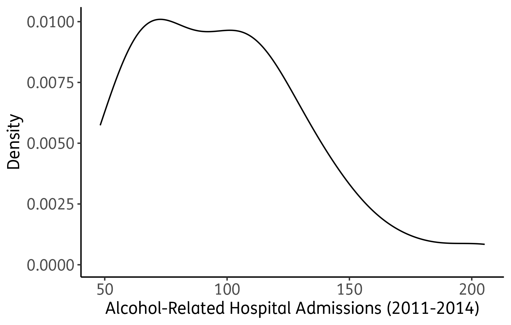
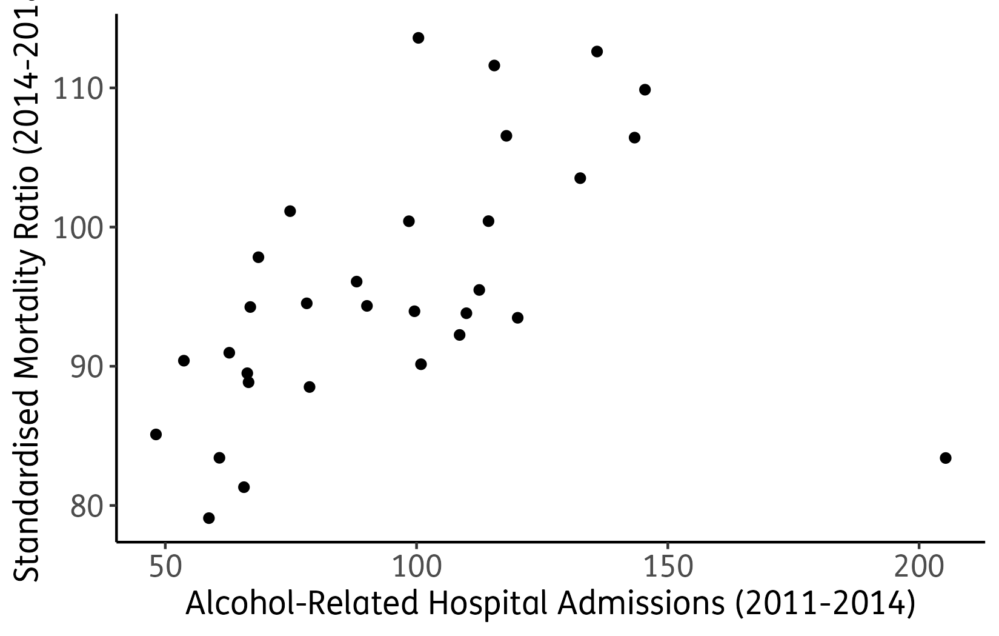
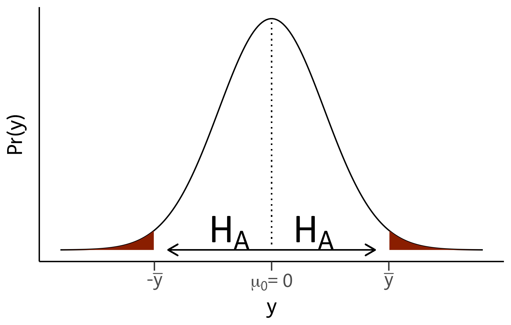
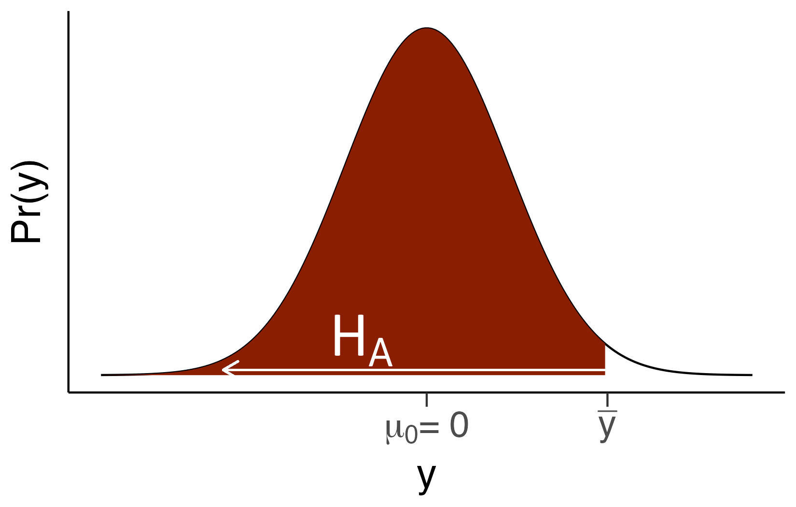

```{r setup, include=FALSE}
knitr::opts_chunk$set(
  echo = TRUE, warning = FALSE, message = FALSE, error = FALSE, collapse = TRUE
)

# Set font size for all code chunks
knitr::knit_hooks$set(size = function(before, options, envir) {
  if (before) {
    if (is.character(options$size)) return(paste0("\\", options$size, "\n"))
    else if (isTRUE(options$size)) return("\\fontsize{7}{7}\\selectfont\n")
  } else {
    return("\\normalsize\n")
  }
})

knitr::opts_chunk$set(size = TRUE)

extrafont::loadfonts(quiet = TRUE)
```


\onehalfspacing


# Effect size, sample size, and power {-}

1. Same effect size, different n (mapping $t$, $n$, and $\hat d$)
    a. With $t=1.6$ and $n=16$, $\hat d = t/\sqrt{n} = 1.6/4 = 0.40$. The power at $n=16$ for $\hat d \approx 0.40$ and $\alpha=0.05$ will be modest (typically well below $0.80$).
    b. Keeping $\hat d$ fixed at $0.40$ and raising $n$ to $64$ requires $t = \hat d \sqrt{n} = 0.40 \times 8 = 3.2$. The app will show the same $\hat d$ but a higher power at $n=64$.
    c. As $n$ increases while the underlying effect stays fixed, the standard error shrinks: $\mathrm{SE} = s/\sqrt{n}$. The test statistic is $t = \dfrac{\bar{x}-\mu_0}{\mathrm{SE}}$, so a smaller $\mathrm{SE}$ makes $|t|$ larger on average. For a fixed $\alpha$, the critical cutoff (e.g., $t_{\alpha/2,\,df}$ for a two-sided test) is essentially fixed, so larger typical $|t|$ increases the chance that $|t| > t_{\alpha/2,\,df}$. Therefore, bigger $n \Rightarrow$ less sampling noise $\Rightarrow$ tighter estimates $\Rightarrow$ higher power.
    
\bigskip

2. Planning with a SESOI and $\alpha$ sensitivity
    a. For $t=2.0$ and $n=30$, $\hat d = t/\sqrt{n} \approx 2.0/\sqrt{30} \approx 0.37$. The app will report the power at $n=30$ using this $\hat d$ (typically moderate at $\alpha=0.05$).
    b. Turning on the SESOI with $d=0.5$ switches the curve to a fixed target effect. The orange marker shows the $n$ giving $80\%$ power at $\alpha=0.05$; for $d=0.5$ this is typically in the few–dozen range for a one-sample $t$-test (on the order of the 30s).
    c. Increasing $\alpha$ to $0.10$ lowers the critical threshold and reduces the required $n$ for a given power; decreasing $\alpha$ to $0.01$ raises the threshold and increases the required $n$. Formally, stricter $\alpha$ increases the critical $t$ value, so a larger $n$ is needed for the same probability of exceeding it under the alternative.

\bigskip

3. Was the study well powered? Post-hoc check and replication planning
    a. With $t=2.1$ and $n=25$, $\hat d = 2.1/\sqrt{25} = 2.1/5 = 0.42$. The app will show the power at $n=25$ for $\hat d \approx 0.42$ and $\alpha=0.05$; this is typically only moderate, not comfortably high.
    b. For replication planning, turn on SESOI and choose the closest option to $\hat d$ (e.g., $d=0.5$). The orange marker will give the $n$ needed for $80\%$ power at the chosen $\alpha$; expect a sample size in the few–dozen range for $d=0.5$ at $\alpha=0.05$.
    c. A significant result with low power can be fragile because small shifts in sampling may miss the effect and estimates are noisier. Picking a SESOI (a target $d$ tied to practical importance) and planning for $80\%$ power helps ensure a replication has adequate sensitivity to detect a meaningfully sized effect.


\begin{tcolorbox}[
  enhanced,
  colback=oupred!30,          % 30% oupred background
  frame hidden,               % hide all borders
  borderline west={4pt}{0pt}{oupred} % thick right border only
]
Summarising Conclusions
\begin{itemize}
\item Power is the probability your test will detect a real effect (reject $H_0$ when the effect truly exists).
\item The curve fixes an effect size $d$ and shows how power increases with $n$.
\item If you base $d$ on your observed test ($\hat d = t/\sqrt{n}$), the curve answers: "If the effect really was the size we observed, how likely would the test be to detect that effect at other sample sizes $n$?"
\item If you base $d$ on a meaningful minimum (SESOI), the curve answers: "How large should $n$ be to reliably detect an effect that actually matters?"
\item The 0.80 (80\%) line is a convention (not a law). Many fields use it as a planning minimum; higher power (e.g., 90\%) is desirable when stakes are high.
\item Rule of thumb: because $t = d\sqrt{n}$, halving $d$ requires about 4× the sample size to keep power roughly the same.
\end{itemize}

\bigskip
Why do many plots show an 80\% power line?
\begin{itemize}
\item 80\% power means choosing $\beta = 0.20$ (so $\text{power} = 1 - \beta = 0.80$). This is a planning convention, not a mathematical law.
\item The convention became common through methodological guidance (e.g., Cohen’s power analysis texts) and is echoed in many applied fields.
\item In higher-stakes settings (e.g., confirmatory clinical trials), targets of 80–90\% power are typical; 90% is often preferred when feasible.
\end{itemize}
\end{tcolorbox}

\newpage

# Case Study: Alcohol-Related Hospital Admissions and Mortality in Scotland {-}


## Data Exploration

Before starting, we need to load libraries and install packages if not already installed. In these exercises we will be using the \texttt{tidyverse} package. 

1. Set your working directory, place the data set in it, and load it into R.
2. Create a new RScript for this case study and annotate it as you go through the exercises presented here. 
3. Load the \texttt{tidyverse} package.

```{r, echo=FALSE}
# Set Working Directory
setwd("~/Dropbox/PO91Q/files/Downloads/Week 5")

library(tidyverse)

# Load data
simd <- read.csv('mortality.csv', header=TRUE)
```


## Descriptive Statistics\label{sec:descr}

1. Produce descriptive statistics for all three numerical variables. 

```{r}
summary(simd$alc16)
```

```{r}
summary(simd$mortality16)
```

```{r}
summary(simd$mortality20)
```


## Visualisation

Let's visualise the distribution of the variable \texttt{alc16}.

```{r eval=FALSE}
ggplot(simd, aes(x=alc16)) +
  geom_density(aes(y=..density..)) +
  theme_classic() +
  scale_x_continuous(name="Alcohol-Related Hospital Admissions (2011-2014)")+
  ylab('Density') +
  theme(axis.text=element_text(size=12),
        axis.title=element_text(size=13))
```

```{r echo=FALSE, fig.show='hide'}
density <- ggplot(simd, aes(x=alc16)) +
  geom_density(aes(y=..density..)) +
  theme_classic() +
  scale_x_continuous(name="Alcohol-Related Hospital Admissions (2011-2014)")+
  ylab('Density') +
  theme(text=element_text(family="FS Me"),
        axis.text=element_text(size=12),
        axis.title=element_text(size=13))+
  theme(
    panel.background = element_rect(fill='transparent'), #transparent panel bg
    plot.background = element_rect(fill='transparent', color=NA), #transparent plot bg
    panel.grid.major = element_blank(), #remove major gridlines
    panel.grid.minor = element_blank(), #remove minor gridlines
    legend.background = element_rect(fill='transparent'), #transparent legend bg
    legend.box.background = element_rect(fill='transparent') #transparent legend panel
  )
ggsave("density.png",density, bg = "transparent")
```

```{r echo=FALSE, out.width="50%", fig.align='center', fig.cap="\\label{fig:dis_alc}Distribution of Alcohol-Related Hospital Admissions (2011-2014)"}

```


1. Reproduce Figure \ref{fig:dis_alc}.
2. What does the distribution tell us about alcohol-related admissions to hospital?
\begin{itemize}
    \item[]\begin{itemize}
        \item \textcolor{waraubergine}{Not perfectly normally distributed, with a positive skew.}
    \end{itemize}
\end{itemize}  
3. How does the shape of the distribution in Figure \ref{fig:dis_alc} relate to the descriptive statistics calculated in Section \ref{sec:descr}?
\begin{itemize}
    \item[]\begin{itemize}
        \item \textcolor{waraubergine}{In a positvely skewed distribution the median is larger than the mean which is the case here. The maximum is also well above the third quartile.}
    \end{itemize}
\end{itemize} 
4. What would happen to the shape of the distribution if the median was smaller than the mean?
\begin{itemize}
    \item[]\begin{itemize}
        \item \textcolor{waraubergine}{If they were identical, then this would be a normal distribution. If the median was smaller than the mean then we would be dealing with a negatively skewed distribution.}
    \end{itemize}
\end{itemize} 


## Hypothesis

We are interested in how alcohol-related admissions to hospital have affected mortality rates in Scotland. The following scatter plot uses the variables \texttt{alc16} and \texttt{mortality20}.

```{r eval=FALSE}
ggplot(simd, aes(alc16, mortality20)) +
  geom_point() +
  xlab('Alcohol-Related Hospital Admissions (2011-2014)') +
  ylab('Standardised Mortality Ratio (2014-2018)') +
  theme_classic() +
  theme(axis.text=element_text(size=12),
        axis.title=element_text(size=13)) 
```

```{r echo=FALSE, fig.show='hide'}
point <- ggplot(simd, aes(alc16, mortality20)) +
  geom_point() +
  xlab('Alcohol-Related Hospital Admissions (2011-2014)') +
  ylab('Standardised Mortality Ratio (2014-2018)') +
  theme_classic() +
  theme(text=element_text(family="FS Me"),
        axis.text=element_text(size=12),
        axis.title=element_text(size=13)) +
  theme(
    panel.background = element_rect(fill='transparent'), #transparent panel bg
    plot.background = element_rect(fill='transparent', color=NA), #transparent plot bg
    panel.grid.major = element_blank(), #remove major gridlines
    panel.grid.minor = element_blank(), #remove minor gridlines
    legend.background = element_rect(fill='transparent'), #transparent legend bg
    legend.box.background = element_rect(fill='transparent') #transparent legend panel
  )
ggsave("point.png",point, bg = "transparent")
```

```{r echo=FALSE, out.width="50%", fig.align='center', fig.cap="\\label{fig:causality}Alcohol-Related Hospital Admissions and Mortality"}

```

1. Reproduce Figure \ref{fig:causality}.
2. Based on this scatter plot, formulate the alternative and the null hypotheses:

|    **H$\pmb{_\text{A}}$:** \textcolor{waraubergine}{The higher the rate of alcohol-related admissions to hospital between 2011 and 2014, the higher the standardised mortality ratio in 2014-2018.}
|
|   **H$\pmb{_0}$:** \textcolor{waraubergine}{The rate of alcohol-related admissions to hospital between 2011 and 2014 and the standardised mortality ratio in 2014-2018 are unrelated.}


\newpage

## Sampling

The data frame \texttt{simd} which we have been using so far represents the population. Let us now draw a random sample of 15 councils as follows:


```{r echo=TRUE}
set.seed(6)
sample <- sample_n(simd, 15)
```

1. Explain the purpose of the \texttt{set.seed} function.
\begin{itemize}
    \item[]\begin{itemize}
        \item \textcolor{waraubergine}{It creates a pseudo-random number.}
    \end{itemize}
\end{itemize} 


## Inferential Statistics

Let us now see if the mortality ratio has changed between the two waves of 2016 and 2020. This is the worked example from the lecture, but I am repeating it here deliberately, so that you can carry out the example yourself. 

1. As a first step, create a new variable measuring the difference between \texttt{mortality20} and \texttt{mortality16}. Make sure that increases are positive and decreases negative. 

```{r echo=TRUE}
sample$diff <- with(sample, mortality20-mortality16)
```

2. What is the sample mean of the differences in mortality rates, variable \texttt{diff}?
```{r echo=TRUE}
summary(sample$diff)
```

3. The sample size of 15 is small. Will it be appropriate to conduct a t-test? Why? Why not?
\begin{itemize}
    \item[]\begin{itemize}
        \item \textcolor{waraubergine}{Yes, as the population distribution is likely to be normal.}
    \end{itemize}
\end{itemize} 

4. Find out whether the difference in mortality rates is significantly different from zero. 
```{r echo=TRUE}
t.test(sample$diff, mu=0,  
       data=sample)
```

\begin{itemize}
    \item[]\begin{itemize}
        \item \textcolor{waraubergine}{There is no statistically significant difference in mortality ratios between the two waves.}
    \end{itemize}
\end{itemize}   

\newpage

5. Draw a graph which depicts the direction of the alternative hypothesis and the p-value. Try not to look at the lecture slides.\label{ex:testdiff}

```{r echo=FALSE, fig.show='hide'}
library(ggthemes)
library(grid)

axis.text.size <- 18
axis.title.size <- 20

x=seq(-4,4,length=200)
y=dnorm(x)

normprob <- data.frame(x,y)

ha <- ggplot(normprob, aes(x=x, y = y)) + 
  geom_density(stat="identity") +
  theme_classic() +
  scale_x_continuous(name = "y",
                     breaks = c(-2.22, 0, 2.22), 
                     labels = c(expression(paste("-",bar(y))), expression(paste(mu[0],"= 0")), expression(bar(y))),
                     limits=c(-4, 4)) +
  scale_y_continuous(name = "Pr(y)") +
  geom_segment(aes(x = 0 , y = 0.01, xend = 0, yend = dnorm(0, 0, 1)), size=0.5, linetype="dotted") +
  geom_ribbon(data=subset(normprob ,x>2.22 & x<4 ),aes(ymax=y),ymin=0,
              fill="#8a1e00",colour=NA) +
  geom_ribbon(data=subset(normprob ,x> -4 & x< -2.22 ),aes(ymax=y),ymin=0,
              fill="#8a1e00",colour=NA) +
  theme(text=element_text(family="FS Me"),
        axis.text.y=element_blank(),
        axis.ticks.y=element_blank()) +
  theme(axis.text=element_text(size=14),
        axis.title=element_text(size=16)) +
  theme(axis.ticks.length=unit(.25, "cm"))+
  geom_segment(aes(x = 0, y = 0.0001, xend = 1.96, yend = 0.0001),
               lineend = "round", linejoin = "round",
               arrow = arrow(length = unit(0.3, "cm"))) +
  geom_segment(aes(x = 0, y = 0.0001, xend = -1.96, yend = 0.0001),
               lineend = "round", linejoin = "round",
               arrow = arrow(length = unit(0.3, "cm"))) +
  annotate(geom="text", x=0.8, y=0.03, label=expression(H[A]),
           color="black", family="FS Me", size=10)+
  annotate(geom="text", x=-0.8, y=0.03, label=expression(H[A]),
           color="black", family="FS Me", size=10)+
  theme(
    panel.background = element_rect(fill='transparent'), #transparent panel bg
    plot.background = element_rect(fill='transparent', color=NA), #transparent plot bg
    panel.grid.major = element_blank(), #remove major gridlines
    panel.grid.minor = element_blank(), #remove minor gridlines
    legend.background = element_rect(fill='transparent'), #transparent legend bg
    legend.box.background = element_rect(fill='transparent') #transparent legend panel
  )
ggsave("ha.png",ha, bg = "transparent")
```

```{r echo=FALSE, message=FALSE, warning=FALSE, out.width='50%',fig.align='center',fig.cap="\\label{fig:twosided}Two-Sided Significance Test"}

```

6. Suppose the Scottish Government claims that mortality rates have decreased. Test this claim. 
```{r echo=TRUE}
t.test(sample$diff, mu=0,  
       data=sample,
       alternative = "less")
```
\begin{itemize}
    \item[]\begin{itemize}
        \item \textcolor{waraubergine}{Absolutely not!}
    \end{itemize}
\end{itemize}  
7. Again, draw a graph which depicts the direction of the alternative hypothesis and the p-value. Try not to look at the lecture slides.\label{ex:testless}
```{r echo=FALSE, fig.show='hide'}

left <- ggplot(normprob, aes(x=x, y = y)) + 
  geom_density(stat="identity") +
  theme_classic() +
  scale_x_continuous(name = "y",
                     breaks = c(0, 2.22), 
                     labels = c(expression(paste(mu[0],"= 0")),expression(bar(y))),
                     limits=c(-4, 4)) +
  scale_y_continuous(name = "Pr(y)") +
  geom_ribbon(data=subset(normprob ,x>-4 & x<2.22 ),aes(ymax=y),ymin=0,
              fill="#8a1e00",colour=NA) +
  theme(axis.text.y=element_blank(),
        axis.ticks.y=element_blank()) +
  theme(axis.text=element_text(size=18),
        axis.title=element_text(size=20)) +
  theme(axis.ticks.length=unit(.25, "cm"))+
  geom_segment(aes(x = 2.2, y = 0.006, xend = -2.5, yend = 0.006),
               lineend = "round", linejoin = "round",
               arrow = arrow(length = unit(0.3, "cm")),
               colour="white") +
  annotate(geom="text", x=-0.8, y=0.04, label=expression(H[A]),
           color="white", family="FS Me", size=10)+
  theme(
    panel.background = element_rect(fill='transparent'), #transparent panel bg
    plot.background = element_rect(fill='transparent', color=NA), #transparent plot bg
    panel.grid.major = element_blank(), #remove major gridlines
    panel.grid.minor = element_blank(), #remove minor gridlines
    legend.background = element_rect(fill='transparent'), #transparent legend bg
    legend.box.background = element_rect(fill='transparent') #transparent legend panel
  )
ggsave("left.png",left, bg = "transparent")
```

```{r echo=FALSE, message=FALSE, warning=FALSE, out.width='50%',fig.align='center',fig.cap="\\label{fig:leftsided}Left-Sided Significance Test"}

```

\newpage

8. Drawing on the results from Exercises \ref{ex:testdiff} and \ref{ex:testless}, reason about the p-value you would obtain if you tested the hypothesis that mortality rates have increased between the waves of 2016 and 2020. 
\begin{itemize}
    \item[]\begin{itemize}
        \item \textcolor{waraubergine}{Using Figure \ref{fig:leftsided}, the p-value for a right-sided test is indicated by the remaining white area. This area must be half of the blue area in Figure \ref{fig:twosided}. $\frac{0.06909}{2}=0.03454$. You can confirm this with:}
    \end{itemize}
\end{itemize}  

```{r echo=TRUE}
t.test(sample$diff, mu=0,  
       data=sample,
       alternative = "greater")
```
\begin{itemize}
    \item[]\begin{itemize}
        \item \textcolor{waraubergine}{This is significant. Mortality rates have indeed increased.}
    \end{itemize}
\end{itemize}  

## Causality

1. Identify the elements of symmetry and asymmetry in the setup of this case study.

\begin{itemize}
\item[]\begin{itemize}
  \item \textcolor{waraubergine}{Symmetry: Alcohol abuse leads to health issues and possibly death. It's not really a theory, but medical reasoning.}
  \item \textcolor{waraubergine}{Asymmetry: I have taken the mortality from a later wave than the alcohol-related admissions to hospital. So, rverse causality is not possible, but bear in mind that a time-lag might be insufficient to justify asymmetry.}
\end{itemize}  \end{itemize} 

2. Consider again Figure \ref{fig:cause} from the lecture. Which aspects of establishing causality has the case study addressed? What is missing?

\begin{itemize}
\item[]\begin{itemize}
  \item \textcolor{waraubergine}{Practically everything is still missing, bar the theory and historical context, and perhaps asymmetry. We have not touched anything else in this graph, yet.}
\end{itemize} \end{itemize} 

```{r, echo=FALSE, engine='tikz', out.width='75%', cache=TRUE, fig.align='center', fig.cap="\\label{fig:cause}Causality Framework"}
\fontfamily{cmss}\selectfont
\begin{tikzpicture}[thick,scale=0.9, every node/.style={scale=0.9},empty node/.style={minimum height=7mm,fill=none}] 
\filldraw[color={rgb,255:red,138;green,30;blue,0}, fill={rgb,255:red,232;green,210;blue,204}, very thick] (-7,-4) rectangle (7,4);
\node[color={rgb,255:red,138;green,30;blue,0}] at (-1.7,-3.6) {Wider Context (e.g specific country, historical context, etc.)};
    \matrix (M)[matrix of math nodes,row sep=-1mm,column sep=0mm,
                minimum size=7mm]{
|[empty node]|  &  |[empty node]|  &  |[empty node]| &   \shortstack{\text{Intervening Variable} \\ \text{indirect causality}}      &  |[empty node]|  &  |[empty node]|   &  |[empty node]|    \\
|[empty node]|  &  |[empty node]|  &  |[empty node]| &   \text{(B)}      			&  |[empty node]|  &  |[empty node]|   &  |[empty node]|    \\
|[empty node]|    &  |[empty node]|  &  |[empty node]| & |[empty node]|     &  |[empty node]|  &  |[empty node]|   &  |[empty node]|    \\
\text{(C)}   &   |[empty node]| & X 						  &   |[empty node]|      &  Y 					 		&  |[empty node]|   &  |[empty node]|    \\
\shortstack{\text{Multiple Causes:} \\ $x_1$, $x_2$, $x_3$, \dots} &  |[empty node]|  &   |[empty node]|  &  |[empty node]|     &  |[empty node]|  &  |[empty node]|   &  |[empty node]|    \\         
|[empty node]|  &   |[empty node]|   &  |[empty node]|  &  \text{(A) and (D)}  &  |[empty node]|   &  |[empty node]| &    \text{(E)}    \\
\shortstack{\text{Multiple Sources of} \\ Spuriousness: $a_1$, $a_2$, $a_3$, \dots}  &   |[empty node]| & |[empty node]|   &  \shortstack{\text{Spurious Association} \\ \text{and Suppressor}} &  |[empty node]|       &  |[empty node]|   &   \shortstack{\text{Statistical} \\ \text{Interaction}} \\
|[empty node]|  &  |[empty node]|  &  |[empty node]| &  |[empty node]|     &  |[empty node]|  &  |[empty node]|   &  |[empty node]|    \\
     };
\draw[ultra thick,color={rgb,255:red,138;green,30;blue,0},->] ([yshift=-0.85ex]M-4-3.east) -- ([yshift=-0.85ex]M-4-5.west);
\draw[thick,black,->] ([yshift=0.35ex]M-4-3.north) -- ([xshift=-0.5ex, yshift=-0.25ex]M-2-4.south);
\draw[thick,black,->] ([xshift=0.5ex, yshift=-0.25ex]M-2-4.south) -- ([xshift=-0.5ex, yshift=0.35ex]M-4-5.north);
\draw[thick,black,->] ([xshift=-0.5ex]M-4-3.west) -- ([xshift=0.5ex]M-4-1.east);
\draw[thick,black,->] ([yshift=0.85ex]M-4-5.west) -- ([yshift=0.85ex]M-4-3.east);
\draw[thick,black,->] ([xshift=-0.5ex, yshift=0.25ex]M-6-4.north) -- ([yshift=-0.35ex]M-4-3.south);
\draw[thick,black,->] ([xshift=0.5ex, yshift=0.25ex]M-6-4.north) -- ([xshift=-0.5ex, yshift=-0.35ex]M-4-5.south);
\draw[thick,black,->] ([xshift=-0.5ex]M-6-7.west) -- (M-4-4.south);
\draw[thin,black,->] (M-7-1.east) -- ([ xshift=-0.5ex]M-7-4.west);
\draw[thick,->,>= stealth]  (M-4-5) edge [out=45,in=315,distance=10mm] (M-4-5);
\end{tikzpicture}
```


       
# References {-}


