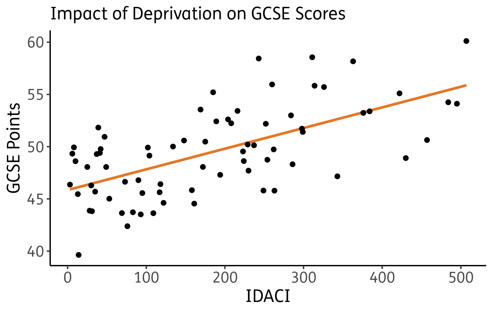
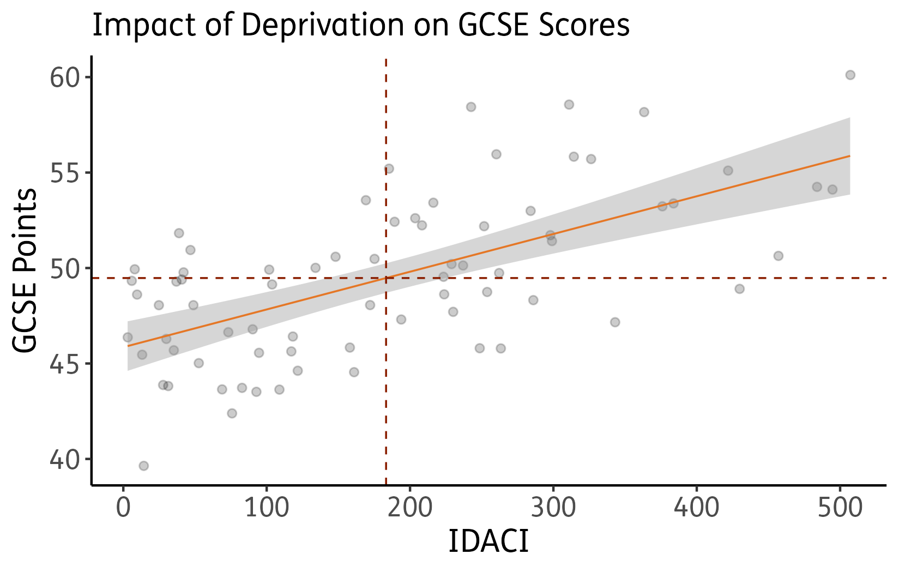

```{r setup, include=FALSE}
knitr::opts_chunk$set(
  echo = TRUE, warning = FALSE, message = FALSE, error = FALSE, collapse = TRUE
)

# Set font size for all code chunks
knitr::knit_hooks$set(size = function(before, options, envir) {
  if (before) {
    if (is.character(options$size)) return(paste0("\\", options$size, "\n"))
    else if (isTRUE(options$size)) return("\\fontsize{7}{7}\\selectfont\n")
  } else {
    return("\\normalsize\n")
  }
})

knitr::opts_chunk$set(size = TRUE)

extrafont::loadfonts(quiet = TRUE)
```


\onehalfspacing

# Core Exercises 


## Load Packages and Data

Before starting, we need to load libraries and install packages if not already installed. In these exercises we will be using the following packages:

1. \texttt{haven}
2. \texttt{ggplot2}
3. \texttt{modelsummary}

We will be using the data set from the lecture, but with a different independent variable this time. These will be of particular interest:

\begin{table}[!h]
\centering
		\begin{tabularx}{\textwidth}{lXr}
		&  \\[-1.8ex] \hline\hline
		&  \\[-1.8ex]
		Variable	&	Label & Year\\ \hline
		&  \\[-1.8ex]
\texttt{const}	&	Parliamentary constituency	&	n/a	\\
\addlinespace

\texttt{gcse}	&	An average score based on a pupil's best eight grades in a group of GCSEs. The maximum a pupil can achieve is 90 points. 	&	2019	\\
\addlinespace

\texttt{eth\_min}	&	Percent of population composed by ethnic minorities	&	2011 \\
\addlinespace

\texttt{idaci}	&	The Income Deprivation Affecting Children Index rank - how it compares to other constituencies	&	2015/16	\\
\addlinespace

\texttt{income}	&	Mean income by constituency	&	2017/18	\\
		& \\[-1.8ex]\hline 
\hline & \\[-1.8ex] 
\end{tabularx}
	\caption{Codebook for \texttt{london} Data Set}
	\label{tbl:london}
\end{table}

Data are taken from @hoc:nd, @gov:2013 and @london:2010. The file is on Moodle. Set your working directory and load the data. 

**Hint:** Note, the data is a .csv file

```{r echo=TRUE, eval=FALSE}
setwd("")

library(tidyverse)
library(haven)
library(modelsummary)

london <- read.csv("london.csv", stringsAsFactors = T)
```

```{r echo=FALSE}
setwd("~/Dropbox/PO91Q/files/Downloads/Week 8/Case Study")

library(tidyverse)
library(haven)
library(modelsummary)

london <- read.csv("london.csv", stringsAsFactors = T)
```

## Inspect your data

Here you can use several basic functions. The dataset does not contain too many variables, so you can start by using \texttt{names()}, \texttt{str()}, etc.

```{r echo=TRUE}
names(london)
dim(london)
```

## Preliminary Analysis

Let's say we want to look at the relationship between income deprivation affecting children and GCSE scores. The two variables are, respectively, \texttt{idaci} and \texttt{gcse}.

Now, formulate the working (alternative) and the null hypothesis. Write them down.

**H$\pmb{_0}$:** \textcolor{warruby}{Income Deprivation affecting children has no statistical relationship with GCSE scores.}

**H$\pmb{_1}$:** \textcolor{warruby}{The higher the level of income deprivation affecting children, the lower the GCSE score in a constituency.}

Which is your dependent variable? \textcolor{warruby}{GCSE Scores}

Run a frequency table on the \texttt{idaci} variable. Does this distribution make sense? Why/why not?

```{r echo=TRUE}
table(london$idaci)
class(london$idaci)
```

Do the same for the other variable. And guess what is the level of measurement.

```{r echo=TRUE}
table(london$gcse)
class(london$gcse)
```


## Visualisation

Let's start with the visualisation of the relationship between the two variables. What is the best way to visualise the relationship considering the level of measurement of our variables?

**Hint:** Probably a scatterplot, right? So, use a scatterplot to visualise the relationship and add the regression line.

You can use \texttt{ggplot}, but also the standard \texttt{plot()} function.

```{r echo=TRUE, out.width='70%', fig.align='center'}
ggplot(london, aes(x = idaci, y = gcse)) +
  geom_smooth(method = lm, se=FALSE) +
  geom_point()
```


Improve the graph by:

1. Adding a regression line.
2. Adding up a relevant title, also possibly a subtitle.
3. Adding axes labels and making them readable.

```{r eval=FALSE}
ggplot(london, aes(x = idaci, y = gcse)) +
  geom_smooth(method = lm, se=FALSE, colour="orange") +
  geom_point() +
  theme_classic() +
  xlab('IDACI') +
  ylab('GCSE Points') +
  ggtitle("Impact of Deprivation on GCSE Scores") +
  theme(axis.text=element_text(size=12),
        axis.title=element_text(size=14)) +
  theme(plot.title = element_text(size = 14))
```


```{r echo=FALSE, fig.show='hide'}
plot1 <- ggplot(london, aes(x = idaci, y = gcse)) +
  geom_smooth(method = lm, se=FALSE, colour="#e57726") +
  geom_point() +
  theme_classic() +
  xlab('IDACI') +
  ylab('GCSE Points') +
  ggtitle("Impact of Deprivation on GCSE Scores") +
  theme(text=element_text(family="FS Me"),
        axis.text=element_text(size=12),
        axis.title=element_text(size=14)) +
  theme(plot.title = element_text(size = 14))+
  theme(
    panel.background = element_rect(fill='transparent'), #transparent panel bg
    plot.background = element_rect(fill='transparent', color=NA), #transparent plot bg
    panel.grid.major = element_blank(), #remove major gridlines
    panel.grid.minor = element_blank(), #remove minor gridlines
    legend.background = element_rect(fill='transparent'), #transparent legend bg
    legend.box.background = element_rect(fill='transparent') #transparent legend panel
  )
ggsave("plot1.png",plot1, bg = "transparent")
```

```{r echo=FALSE, message=FALSE, warning=FALSE, out.width="70%",fig.align='center'}

```


## Visualisation 2.0

Now, draw a vertical and horizontal line corresponding to the mean of your variables using \texttt{geom\_hline} and \texttt{geom\_vline}. You can thus check if the regression line passes through the mean of X and Y. (see: https://www.rdocumentation.org/packages/ggplot2/versions/0.9.1/topics/geom_hline).

You can improve the scatterplot using a series of arguments (e.g., alpha) in the \texttt{geom\_point()} function in ggplot. Try to improve the Aesthetics of the scatterplot playing with alpha, for instance. (see: https:
//www.rdocumentation.org/packages/ggplot2/versions/3.4.0/topics/geom_point).


```{r eval=FALSE}
ggplot(london, aes(idaci, gcse)) +
  geom_point(position='jitter', alpha = 1/5) +
  xlab('IDACI') +
  ylab('GCSE Points') +
  ggtitle("Impact of Deprivation on GCSE Scores") +
  theme_classic() +
  geom_smooth(method = 'lm', se=T, colour = 'orange', lwd=0.4)+
  geom_hline(yintercept = mean(london$gcse, na.rm=TRUE), color='red', lty='dashed', lwd=0.4)+
  geom_vline(xintercept = mean(london$idaci,na.rm=TRUE), color='red', lty='dashed', lwd=0.4)+
  theme(axis.text=element_text(size=12),
        axis.title=element_text(size=14)) +
  theme(plot.title = element_text(size = 14))
```


```{r echo=FALSE, fig.show='hide'}
plot3 <- ggplot(london, aes(idaci, gcse)) +
  geom_point(position='jitter', alpha = 1/5) +
  xlab('IDACI') +
  ylab('GCSE Points') +
  ggtitle("Impact of Deprivation on GCSE Scores") +
  theme_classic() +
  geom_smooth(method = 'lm', se=T, colour = '#e57726', lwd=0.4)+
  geom_hline(yintercept = mean(london$gcse, na.rm=TRUE), color='#8a1e00', lty='dashed', lwd=0.4)+
  geom_vline(xintercept = mean(london$idaci,na.rm=TRUE), color='#8a1e00', lty='dashed', lwd=0.4)+
  theme(text=element_text(family="FS Me"),
        axis.text=element_text(size=12),
        axis.title=element_text(size=14)) +
  theme(plot.title = element_text(size = 14))+
  theme(
    panel.background = element_rect(fill='transparent'), #transparent panel bg
    plot.background = element_rect(fill='transparent', color=NA), #transparent plot bg
    panel.grid.major = element_blank(), #remove major gridlines
    panel.grid.minor = element_blank(), #remove minor gridlines
    legend.background = element_rect(fill='transparent'), #transparent legend bg
    legend.box.background = element_rect(fill='transparent') #transparent legend panel
  )
ggsave("plot3.png",plot3, bg = "transparent")
```

```{r echo=FALSE, message=FALSE, warning=FALSE, out.width="70%",fig.align='center'}

```


## Saving the Scatterplot

You can save a graph as .png, .JPG (even .pdf) that you can then import in a word document. Although there are many way to use your R output, saving a graph might be sometimes useful.

Use the function \texttt{ggsave()} to save your scatterplot. Again, there are tons of examples online, google it.

**Hint:** You first need to store the graph in an object.

**Hint 2:** The file will end up in your working directory

```{r eval=FALSE, echo=TRUE}
# First, create an object #
scatterplot <- ggplot(london, aes(idaci, gcse)) +
  geom_point(position='jitter', alpha = 1/5) +
  xlab('IDACI') +
  ylab('GCSE Points') +
  ggtitle("Impact of Deprivation on GCSE Scores") +
  theme_classic() +
  geom_smooth(method = 'lm', se=T, colour = 'orange', lwd=0.4)+
  geom_hline(yintercept = mean(london$gcse, na.rm=TRUE), color='red', lty='dashed', lwd=0.4)+
  geom_vline(xintercept = mean(london$idaci,na.rm=TRUE), color='red', lty='dashed', lwd=0.4)+
  theme(axis.text=element_text(size=12),
        axis.title=element_text(size=14)) +
  theme(plot.title = element_text(size = 14))
```


```{r eval=FALSE, echo=TRUE}
# Then save the file #
save_plot("scatterplot_idaci.png", scatterplot)
```

\newpage


## Regression Analysis (yes, finally)

Now we can finally run a linear regression with \texttt{gcse} as the outcome variable and \texttt{idaci} as the predictor using the \texttt{lm()} function. Store the results in an object called \texttt{model} and visualise the regression output using \texttt{summary()}. 

```{r echo=TRUE}
# Store the results in an object called model #
model<-lm(gcse ~ idaci, london)
# Visualise the regression output using summary() #
summary(model)
```


You can also extract specific blocks of the output table. One way of doing it is to use the brackets [] after the \texttt{summary()} function. For example \texttt{summary()[8]}. Try to extract the block of Coefficients from the table, like this:


```{r echo=TRUE}
summary(model)[4]
```

\newpage

## Interpretation

Interpret the results, starting with model evaluation.

1. Is the p-value of the F-statistics statistically significant? We will be discussing this in our following lectures.
    - Yes, highly significant with p-value: 2.398e-09.
2. How much variation in the outcome variable does the model explain? What does this tell us about the model?
    - Income Deprivation Affecting Children explains 39.65% of the variation in GCSE scores in London constituencies. This is not bad for a single variable, but there are probably other factors, as well. 
3. What's the value of the slope? What does it mean?
    - 0.019765. For every additional rank in the Income Deprivation Affecting Children Index, the GCSE score will rise by 0.019765, on average.
4. What's the value of the intercept? How do we interpret it? Is it statistically significant? What does it mean in practice?
    - The intercept (45.852958) is highly significant, and indicates that if the Income Deprivation Affecting Children Index was zero, the average GCSE score in London constituencies would be 45.86.
5. Interpret the results (in plain language) referring to the hypothesis you formulated above.
    - The higher the level of income deprivation affecting children, the lower the GCSE score in a London constituency, and therefore we verify our alternative hypothesis. 


# References {-}


